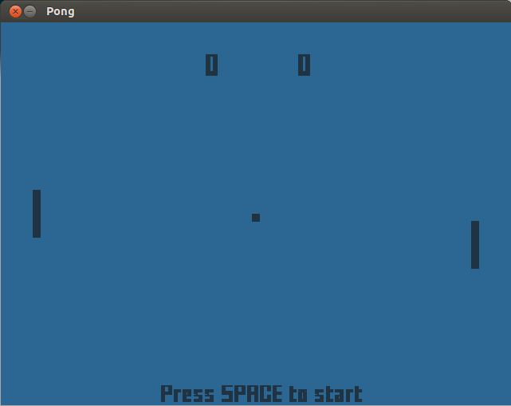

The Pong game
=============

Pong clone written in C++ with SDL 2.0.

## Installation

### Ubuntu

You will need to download and install:

+ [SDL 2.0](https://www.libsdl.org/hg.php)
+ [SDL Image 2.0](http://www.libsdl.org/projects/SDL_image/)
+ [SDL Mixer 2.0](http://www.libsdl.org/projects/SDL_mixer/)
+ [SDL TTF 2.0](https://www.libsdl.org/projects/SDL_ttf/)

Then, just type `make` to compile.

### OS X

1. Install [Homebrew](http://brew.sh/):
    + `brew install sdl2;`
    + `brew install sdl2_image;`
    + `brew install sdl2_ttf;`
    + `brew install sdl2_mixer;`
2. Type `make` to compile.

## Run the game

To run the game, type `./pong`. You can type `./pong joystick` to play with the joystick.

## To-do

+ ~~Comment code~~
+ ~~Enhence AI~~
+ ~~Add collision sounds~~
+ ~~Add joystick support~~
+ ~~Convert to OOP~~
+ ~~Test on OS X~~
+ Processor independant game speed
+ Finish the Windows version
+ Add game menu
+ Add themes
+ Add keyboard support
+ Add multiplayer option (local and remote)
+ Add different resolutions
+ Add AI difficulty
+ Use C++11 smart pointers
+ Add lua code

## Credits

Chafic Najjar - <chafic.najjar@gmail.com>

Thank you [Piotr Yordanov](https://github.com/tUrG0n) and [Roy Naufal](https://github.com/roynaufal) for the help.
