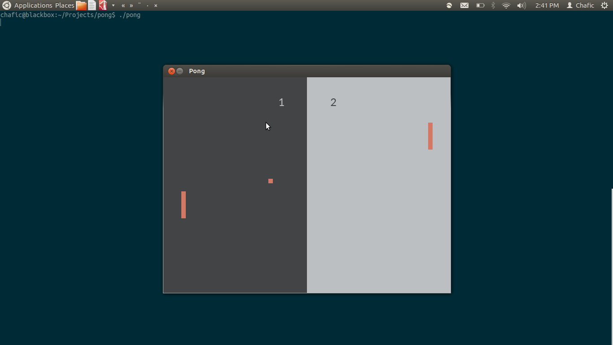
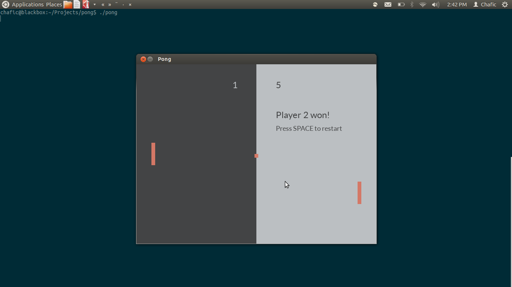

The Pong game
=============

Pong clone written in C++ with SDL 2.0.

  

Installation
=======

## Ubuntu

You will need:
+ [SDL Mixer 2.0](http://www.libsdl.org/projects/SDL_mixer/)
+ [SDL TTF 2.0](https://www.libsdl.org/projects/SDL_ttf/)

Just run ``make`` to compile and ``./pong`` to play.

## Mac

You need to have [brew](http://brew.sh/) installed.
After that, just run the script ``./install.mac.sh`` and ``./pong`` to play.

## Windows

Not yet tested.

To-do
=====

+ ~~Comment code~~
+ ~~Enhence AI~~
+ Finish the Windows version
+ ~~Add collision sounds~~
+ Add game menu
+ Add themes
+ Add keyboard support
+ Add joypad support
+ Add multiplayer option (local and remote)
+ Add different resolutions
+ Add AI difficulty

Credits
=======

Chafic Najjar - <chafic.najjar@gmail.com>

Thank you [Piotr Yordanov](https://github.com/tUrG0n) for the Mac script and game theme colors.

Thank you [Roy Naufal](https://github.com/roynaufal) for contributing to fixing the ball trajectory.
